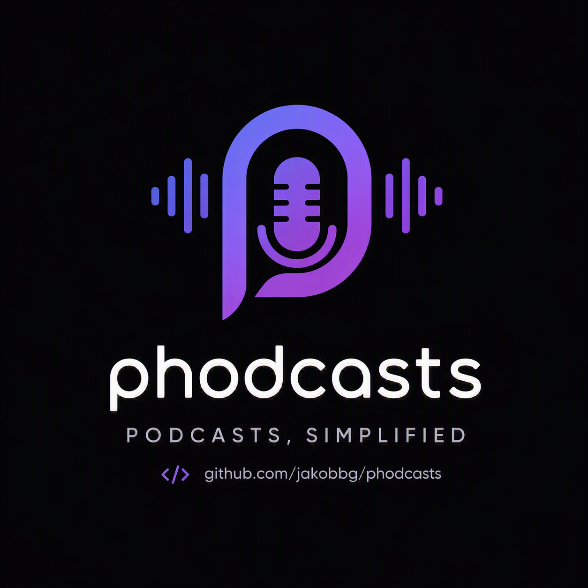

# phodcasts

<p align="center">
  
</p>

A lightweight PHP server that turns a folder of audio files into podcast-app-compatible RSS feeds. Point it at a directory, and every subfolder becomes a subscribable podcast feed — no database, no dependencies, and minimal configuration.

The codebase is being modularized for readability and maintenance. `index.php` remains the entrypoint and dispatcher, while shared logic now lives under `config/` and `src/`, and the index page template lives in `views/index.phtml`.

Intended for self-hosters who have downloaded podcasts or ripped audiobooks to a NAS and want to re-subscribe to them in a standard podcast app (Apple Podcasts, Overcast, Pocket Casts, etc.).

## What it does

- Scans two directories — one for **podcasts**, one for **audiobooks** — and generates an RSS 2.0 + iTunes feed per subfolder
- Serves a web index listing all feeds with cover art, episode count, and newest-episode age
- Streams audio files with HTTP range-request support (seekable playback, resumable downloads)
- **Podcasts** sort newest-first; **audiobooks** sort ascending by filename (chapter 1 first) — enforced via `pubDate` so podcast apps respect it regardless of their default sort
- Picks up `cover.jpg` / `cover.png` / `folder.jpg` / `folder.png` as podcast artwork
- Works correctly behind a reverse proxy (respects `X-Forwarded-Proto` / `X-Forwarded-Host`)
- **Cleans up episode titles** automatically — raw filenames are transformed into readable labels before they appear in your podcast app (see [Episode title cleanup](#episode-title-cleanup))
- **Rich link previews** — Open Graph and Twitter Card meta tags make shared links look great in iMessage, Slack, Discord, etc. Includes an `apple-touch-icon` for adding the page to the iOS home screen
- **Subscribe in Apple Podcasts** — one-click button uses a clean path URL (`podcast://host/feed/…`) with no query string, so it works reliably in Chrome and Safari alike
- **Accessible** — semantic landmarks, skip link, visible focus rings, reduced-motion support, emoji hidden from screen readers, `<time>` elements for dates (see [Accessibility](#accessibility))

## Requirements

- PHP 8.1+
- Apache with `mod_rewrite` enabled (for the clean feed URL paths)

## Setup

1. Copy the full project (`index.php`, `.htaccess`, `config/`, `src/`, `views/`, and image assets) to your web root (or virtual host directory).
2. Edit the constants in `config/constants.php`:

```php
const PODCAST_ROOT    = '/mnt/torrents/Podcasts';
const PODCASTS_SUBDIR = 'Podcasts';
const BOOKS_SUBDIR    = 'Books';
const FEED_LANGUAGE   = 'no';
```

3. Organise your audio files into subfolders:

```
PODCAST_ROOT/
├── Podcasts/
│   └── My Show/
│       ├── cover.jpg
│       └── episode.2024-01-01.mp3
└── Books/
    └── Some Audiobook/
        └── 01-chapter.m4b
```

4. Place the provided image files (`logo.png`, `og.png`, `apple-touch-icon.png`,
   `favicon.png`) in the same directory as `index.php` so that link previews
   and browser icons work out of the box. The web server serves them directly.

Each immediate subfolder becomes one feed, accessible at `?feed=Podcasts/My+Show`
or via the clean path `feed/Podcasts/My+Show`.

## Subscribing in a podcast app

Each card on the index page has two buttons:

| Button | What it does |
|---|---|
| **Apple Podcasts** | Opens Apple Podcasts and subscribes immediately (works in Chrome and Safari on macOS and iOS) |
| **Copy RSS** | Copies the raw RSS URL to the clipboard — paste it into any podcast app's "Add by URL" dialog |

The "Apple Podcasts" link uses the `podcast://` URL scheme with a clean path (no query string). An Apache `mod_rewrite` rule maps `/feed/Show+Name` to the PHP RSS handler, which lets the link work reliably across all browsers. Without this, browsers sometimes strip query strings when handing off custom URL schemes to native apps.

## Smoke tests

Run lightweight no-dependency smoke tests from the project root:

```bash
make smoke
```

Alternative (if you do not want to use `make`):

```bash
sh tests/run_smoke.sh
```

They validate high-risk logic such as episode title normalization, feed path safety checks, media stream/range/ETag behavior, reverse-proxy URL generation, and required project structure.

## Episode title cleanup

Raw filenames are rarely podcast-app-friendly. `episode_title()` transforms them
into clean, readable labels:

| Filename (no extension) | Episode title |
|---|---|
| `Papaya.2026-01-19` | `19. januar 2026` |
| `tore.og.haralds.podcast.podme.2026.s09e10` | `Season 9 – Episode 10` |
| `avsnitt042` | `Avsnitt 42` |
| `07xKapittelx2xxFredagx20xxdesember` | `Kapittel 2` |
| `01xMennxsomxhaterxkvinner` | `Menn som hater kvinner` |
| `jo_nesbø-blod_på_snø-0101` | `CD 1, Spor 1` |
| `CD01T05` | `CD 1, Spor 5` |
| `CD-1008` | `CD 10, Spor 8` |
| `07-Track-A07` | `CD 7, Track A` |
| `01 - Track 1` *(in subfolder `CD1/`)* | `CD 1, Track 1` |
| `1-01 Spor 01` | `CD 1, Spor 1` |
| `Kass1sideB` | `Kassett 1, Side B` |
| `Kafka på stranden - Episode 00` | `Episode 00` |
| `Macbeth, Part 1` | `Macbeth, Part 1` *(unchanged)* |

Rules applied in order:

1. **Separator normalisation** — filenames with no spaces but dot- or
   underscore-separated words get those replaced with spaces.
2. **Feed-name prefix stripping** — if the filename starts with the feed/show
   name (or the title part after `"Author – "`), that prefix is removed.
   Separator characters are interchangeable during matching.
3. **Pattern matching** — season/episode codes (`S09E10` → `Season 9 – Episode 10`),
   ISO dates, `avsnitt`, `xKapittel`-encoded chapters, `CD##T##`, `CD-NNN`,
   `NN-Track-XNN`, bare Spor/Track numbers, Kassett sides, and 4-digit `CCTT`
   codes are each detected and reformatted.
4. **Parent-directory CD context** — when a file lives inside a subfolder named
   `CD 1`, `cd01`, `Hodejegerne CD3`, etc., that disc number is attached to
   titles that lack it (e.g. a bare `05.mp3` becomes `CD 1, Spor 5`).
5. **Generic cleanup** — leading track-sequence numbers (`01 - `, `02. `) are
   stripped, and the first letter is capitalised.

## Accessibility

The web index is built to work well for keyboard and screen-reader users:

- **Skip link** — a "Skip to main content" link is the first focusable element on the page; it becomes visible on keyboard focus and lets users jump past the header and filter bar
- **Semantic landmarks** — `<header>`, `<nav>`, `<main>`, and `<footer>` are used correctly so assistive technology can navigate by region
- **Heading structure** — each podcast/audiobook card contains an `<h2>` heading, making it possible to navigate between shows with a screen reader's heading shortcut
- **Emoji** — all decorative emoji (🎙, 📚) are wrapped in `aria-hidden="true"` so screen readers announce the text label only, not the emoji description
- **Dates** — "Newest: 3 days ago" uses a `<time datetime="YYYY-MM-DD">` element so the machine-readable date is available to assistive technology
- **Focus rings** — `:focus-visible` outlines on all interactive elements (links, buttons, filter tabs); `.btn.primary` uses a white outline so it is visible against the gradient background
- **Reduced motion** — `@media (prefers-reduced-motion: reduce)` disables hover transitions and the button lift effect for users with the OS "Reduce Motion" setting enabled
- **Copy RSS feedback** — when the clipboard write succeeds, the button's `aria-label` is updated to "Copied to clipboard" for the 2-second confirmation window, then restored

## License

See [LICENSE](LICENSE).

